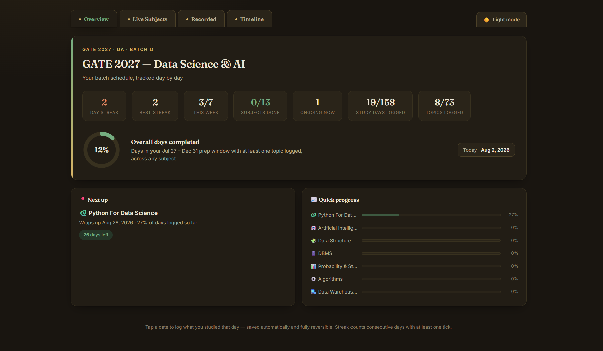
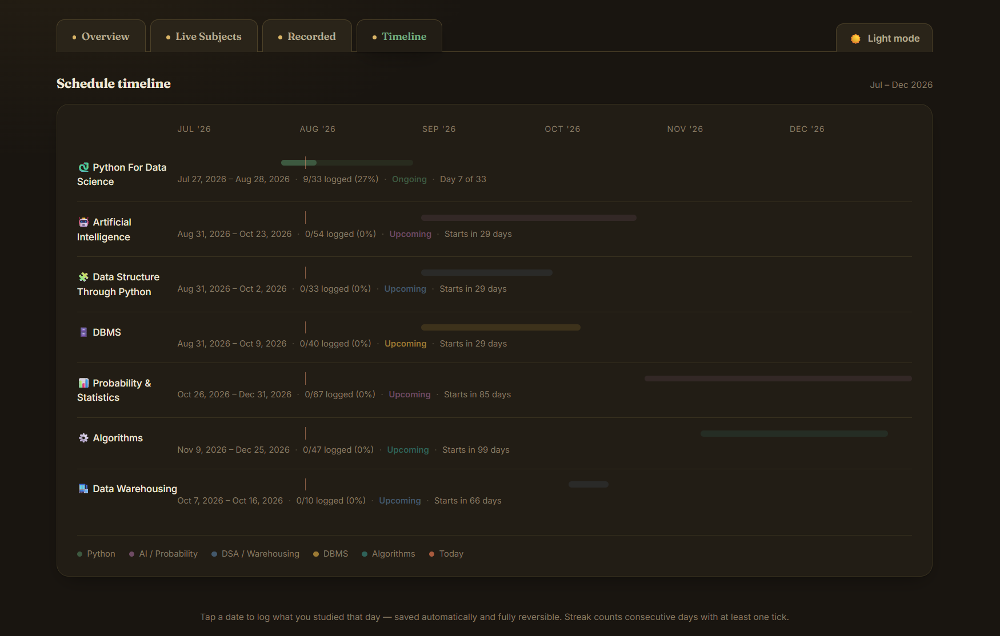
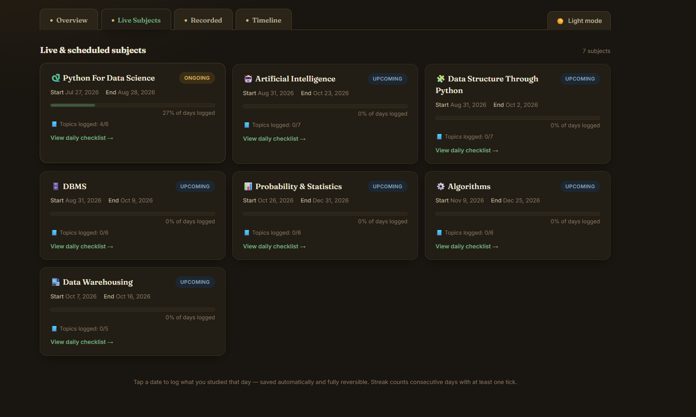
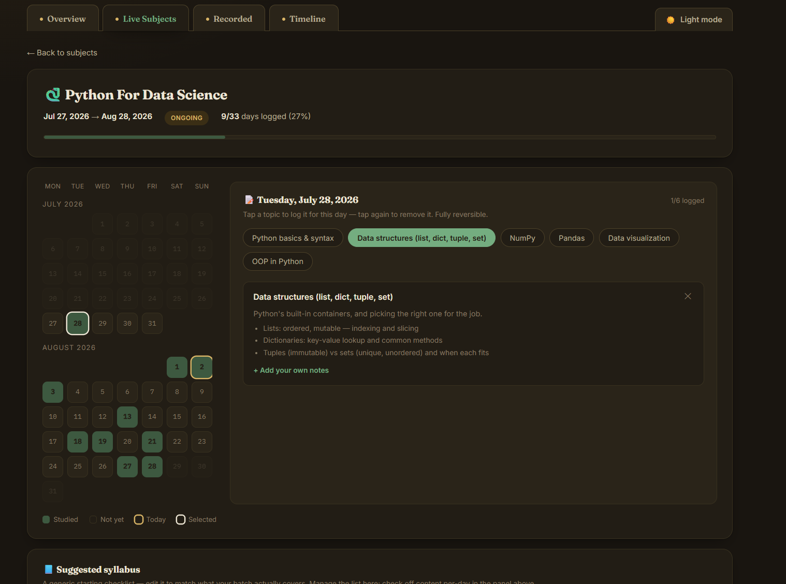
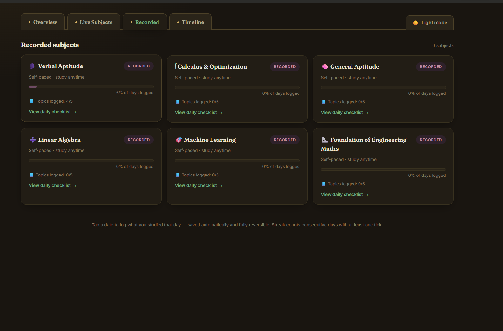
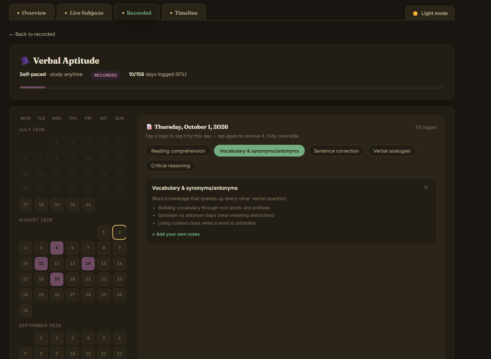

# GATE DA — Batch Tracker

A day-by-day study tracker for a **GATE 2027 Data Science & AI (DA)** batch — calendar-based logging per subject, an editable syllabus checklist with your own notes, a schedule timeline, and a dashboard with streaks and progress stats.

No build step, no dependencies, no account required.

## Table of contents

- [Overview](#overview)
- [Features](#features)
- [Screenshots](#screenshots)
- [Getting started](#getting-started)
- [Hosting](#hosting)
- [Data & storage](#data--storage)
- [Project structure](#project-structure)
- [Customization](#customization)
- [Known limitations](#known-limitations)
- [Roadmap ideas](#roadmap-ideas)
- [Contributing](#contributing)
- [License](#license)

## Overview

This started as a simple schedule table and grew into a small tracking app: 13 subjects (7 live with real batch dates, 6 self-paced/recorded), each with its own calendar, syllabus, and notes. Everything is tracked at the level of "what did I actually study on this specific day," not just a generic percentage bar.

## Features

**Dashboard (Overview)**
- Current streak and best streak (longest ever), tracked separately.
- "This week" — how many of the last 7 days had something logged.
- Subjects done, ongoing count, total study days logged, total topics logged.
- A completion ring showing days logged across the whole batch window.
- "Next up" card — whichever subject is closest to wrapping up, or closest to starting.
- "Quick progress" list — every subject's progress bar at a glance, click-through to any of them.

**Live Subjects**
- 7 subjects with real start/end dates.
- Each subject opens into its own page with a full month-by-month calendar (Monday–Sunday aligned).
- Tap any date within the subject's window to log what you covered that day.
- Status badges (Ongoing / Upcoming / Completed) computed live from today's date.

**Recorded Subjects**
- 6 self-paced subjects, tracked on a shared study window with the exact same calendar/syllabus/notes system as live subjects — just without a fixed status.

**Per-day logging**
- Tapping a date shows a set of topic pills for that subject.
- Tap a pill to log that topic for that day — it expands into a small card with a short study-note summary.
- Tap again to remove it — fully reversible, nothing is ever destructive.

**Syllabus & notes**
- Every subject ships with a starting syllabus (editable — add or remove topics freely).
- Each default topic includes a short predefined overview + key points.
- Every topic (default or custom) also supports your own free-text notes, editable anytime.

**Timeline**
- A Gantt-style view of all 7 live subjects across the batch window.
- Each bar shows a soft background for the full date range and a solid fill for days actually logged.
- A line marks today. Click any row to jump into that subject.

**Other**
- Dark mode toggle, remembered between visits.
- Every action (checking a day, editing a topic, writing a note, switching themes) saves automatically and updates the UI instantly.

## Screenshots

<table>
<tr>
<td width="50%" valign="top">

<br/>
<b>Overview dashboard</b>
<br/>
Streak (current + best), this week's activity, subjects done, total study days and topics logged, plus a completion ring for the whole batch window. The "Next up" and "Quick progress" panels give a full status check without leaving the page.
</td>
<td width="50%" valign="top">

<br/>
<b>Schedule timeline</b>
<br/>
A Gantt-style view of all 7 live subjects. Each bar shows a soft background for its full date range and a solid fill for days actually logged, with a line marking today. Click any row to jump into that subject.
</td>
</tr>
<tr>
<td width="50%" valign="top">

<br/>
<b>Live subjects</b>
<br/>
All 7 scheduled subjects as cards — status (Ongoing / Upcoming / Completed), a progress bar for days logged, and how many syllabus topics have been covered so far.
</td>
<td width="50%" valign="top">

<br/>
<b>Subject detail</b>
<br/>
A full month-by-month calendar for the subject. Tap any date to open the day panel on the right — log topics as pills, and each one expands into a short study-note summary with room to add your own notes.
</td>
</tr>
<tr>
<td width="50%" valign="top">

<br/>
<b>Recorded subjects</b>
<br/>
Self-paced subjects tracked with the same system as live ones, just sharing a common study window instead of fixed batch dates.
</td>
<td width="50%" valign="top">

<br/>
<b>Recorded subject detail</b>
<br/>
The same calendar + topic-logging system as live subjects — shown here for Verbal Aptitude, with a topic logged for the selected day.
</td>
</tr>
</table>

## Getting started

Open `index.html` in a browser. There's nothing to install or configure.

## Hosting

Any static host works:

- **GitHub Pages** — push this repo, then in **Settings → Pages** set the source to the `main` branch, `/ (root)`. It'll be live at `https://<your-username>.github.io/gate-da/` shortly after.
- **Netlify** — drag-and-drop the folder onto the Netlify dashboard, or connect the repo. No build command needed.
- **Vercel** — import the repo, framework preset "Other," no build command, output directory `/`.
- **Cloudflare Pages** — connect the repo, leave build command empty, output directory `/`.

## Data & storage

Progress (calendar ticks, syllabus edits, your notes, streak, theme) saves automatically to the browser's `localStorage`. Practically, that means:

- Data is tied to **one browser on one device** — it won't sync across your phone and laptop, or between different browsers on the same machine.
- Clearing site data/cache for the page will erase your progress.
- Works fully offline once loaded — no account or network needed after that.

The storage calls are centralized in two functions (`storeGet` / `storeSet`) near the top of the script. Swapping in a real backend later (Firebase, Supabase, a small API) means changing those two functions — the rest of the app doesn't need to know or care where the data lives.

## Project structure

```
gate-da/
├── index.html    — the entire app (markup, styles, and logic in one file)
├── favicon.svg   — browser tab icon
├── assets/       — README screenshots
├── README.md     — this file
└── LICENSE       — MIT license
```

## Customization

All of the editable content lives near the top of the `<script>` block in `index.html`:

| What | Where |
|---|---|
| Subject names, dates, colors | `subjects` array (live) and `recorded` array (self-paced) |
| Default syllabus per subject | `defaultTopics` |
| Predefined topic study notes | `topicSummaries` |
| Overall batch window | `BATCH_WINDOW_START` / `BATCH_WINDOW_END` |
| Color palette / theme | CSS custom properties at the top of `<style>` (`:root` and `:root[data-theme="dark"]`) |

All syllabus and note content is generic and self-written — not sourced from any specific course material — so it's worth checking against your actual syllabus and swapping in specifics where it matters.

## Known limitations

- No multi-device sync (see [Data & storage](#data--storage)).
- No authentication or multi-user support — this is a personal single-user tracker.
- The "days logged" figures reflect activity you log yourself; nothing is auto-tracked or verified.

## Roadmap ideas

Not implemented, but reasonable next steps if this grows:
- Export/import progress as a JSON file (manual backup, or moving between devices).
- A real backend for cross-device sync.
- Printable/exportable weekly or monthly summary.

## Contributing

This is a small personal-scale project — feel free to fork it and adapt it to your own batch, dates, and syllabus. Pull requests for bug fixes are welcome.

## License

MIT — see [`LICENSE`](./LICENSE) for the full text. Update the copyright holder name in that file before publishing.
